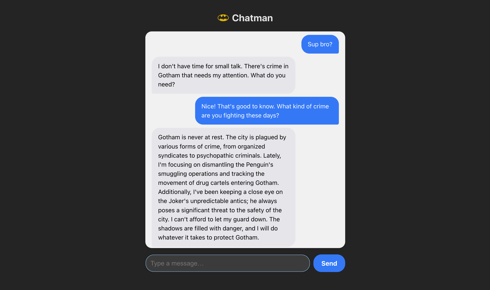

# Chatman 🦇💬

**Chatman** is a Batman-themed chat app powered by OpenAI's GPT‑4o. Ask anything and get a response from the Dark Knight himself.



## Features

- 🦇 Batman stays in character — always.
- 💬 Smooth, auto-scrolling chat interface.
- ⚡ Typing indicator while waiting for response.
- 🔗 Frontend + backend integrated for real GPT‑4o replies.

---

## 🧩 Tech Stack

- **Frontend:** React + Vite
- **Backend:** Node.js + Express
- **AI:** OpenAI GPT-4o-mini (via Chat Completions API)

---

## 🚀 Getting Started

### 1. Clone this repo

```bash
git clone https://github.com/yourusername/chatman
cd chatman
```

### 2. Install dependencies

```bash
# For frontend
cd frontend
npm install

# For backend
cd ../backend
npm install
```

### 3. Set up your API key

In `backend/server.js`, replace:

```js
const OPENAI_API_KEY = 'ENTER YOUR OWN API KEY HERE';
```

with your actual OpenAI API key.

---

## 🖥️ Running the App

### Start backend

```bash
cd backend
node server.js
```

Runs at: [http://localhost:3001](http://localhost:3001)

### Start frontend

```bash
cd frontend
npm run dev
```

App runs at: [http://localhost:5173](http://localhost:5173) (default Vite port)

---

## ✉️ How It Works

1. User types a message in the UI.
2. Frontend sends a POST request to `/api/gpt4o`.
3. Backend forwards it to OpenAI's API using your API key.
4. The response is shown in the chat — as Batman.

---

## 📌 Notes

- You must use your own OpenAI API key.
- This is a demo — no authentication or error handling for production.
- GPT‑4o-mini is configured with a system message: *"You are Batman."*

---

🦇 *"I'm not a chatbot. I'm Batman."*
